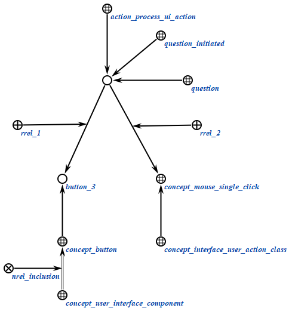
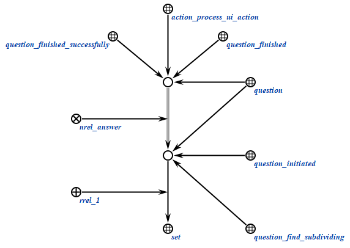

### Agent for processing of the user interface action

The task of this agent is to process user interface action that was performed on the specified interface component.

**Action class:**

action_process_ui_action

**Parameters:**

1. component
1. interface user action class

#### Work example

**Request:**

**Response:**

