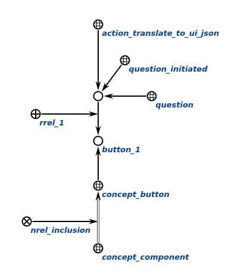
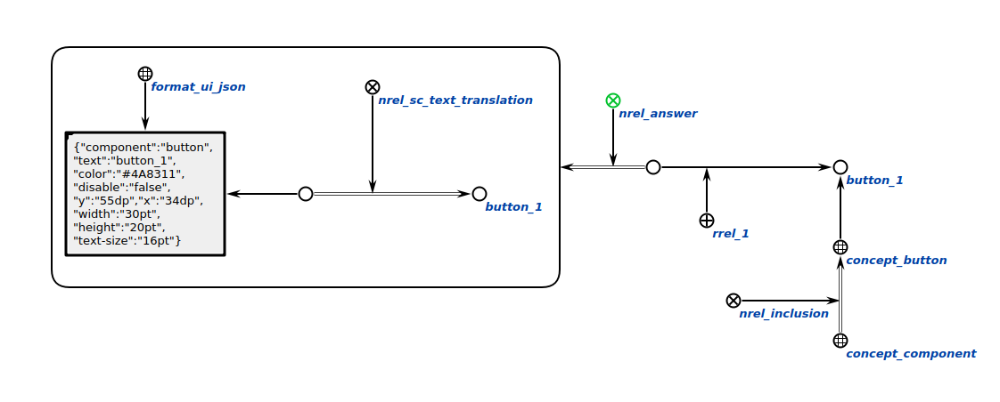

### Agent for translating interface component to format ui-json

The task of this agent is to translating interface component to format ui-json.

**Action class:**

action_translate_to_ui_json

**Parameters:**

component

#### Work example

**Request:**

**Response:**
